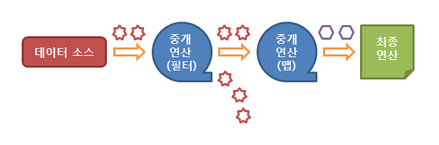

# 스트림 (Stream)

> 스트림의 도입
- 기존의 데이터를 다루는 방식
  :  for문과 Iterator를 이용
  : 너무 길고 알아보기 어렵다.
  : 재사용성이 떨어진다.
  : 데이터 소스마다 다른 방식으로 다뤄야함.
  (List를 정렬할때는 Collections.sort() 사용, 배열을 정렬할때는 Arrays.sort()를 사용)
  -> 불편함 증가
-  이러한 문제를 해결하기 위해 만든 것이 **스트림**이다.

> 스트림이란?
- 데이터 소스를 추상화하고 데이터를 다루는데 자주 사용되는 메서드를 정의
- 데이터 소스 추상화?
  : 데이터 소스가 무엇이던간에 같은 방식으로 다룰 수 있게 됨.
  -> 코드의 재사용성이 높아짐.

> 스트림의 장점
1. 데이터 소스를 변경하지 않는다.
```java
List<String> sortedList = strStream2.sorted().collect(Collectors.toList());
// 기존의 데이터 소스를 정렬(sorted())하고, 새로운 리스트로 만들어 반환한다.
```
2. 일회용이다.
```java
// 스트림은 한번 사용하면 닫혀서 다시 사용할 수 없다. 필요하다면 다시 생성한다.
strStream1.sorted().forEach(System.out::println);
int numOfStr = strStream1.count(); // error! 스트림이 이미 닫혔다.
/* forEach() 메서드
: 해당 스트림의 요소를 하나씩 소모해가며 순차적으로 요소에 접근하기 때문에
  같은 스트림으로는 forEach() 메소드를 한 번밖에 호출할 수 없다.
*/ 
```
3. 작업을 내부 반복으로 처리한다.
```java
for(String str : strList) {
	System.out.println(str);
}

// 스트림의 내부 반복 : 반복문을 메서드의 내부에 숨길 수 있다.
stream.forEach(System.out::println);
// forEach()는 메서드 안으로 for문을 넣은 것
```
* 스트림 API가 동작하는 흐름
  

> 스트림의 중간연산 filter(), map(), flatMap()
* filter()
  : 해당 스트림에서 주어진 조건(predicate)에 맞는 요소만으로 구성된 새로운 스트림을 반환
```java
// 스트림에서 홀수만을 골라냄.
stream2.filter(n -> n % 2 != 0).forEach(e -> System.out.print(e + " "));
```

* map()
  : 해당 스트림의 요소들을 주어진 함수에 인수로 전달하여, 그 반환값들로 이루어진 새로운 스트림을 반환
```java
Stream<String> stream = Stream.of("HTML","CSS","JAVA","JAVASCRIPT");
stream.map(s -> s.length()).forEach(System.out::println);
/* 실행결과 : 
4
3
4
10
*/
```

* flatMap()
  : 스트림의 요소가 배열이라면, flatMap() 메소드를 사용하여 각 배열의 각 요소의 반환값을 하나로 합친 새로운 스트림을 반환
```java
String[] arr = {"I study hard", "You study JAVA", "I am hungry"};  
  
Stream<String> stream = Arrays.stream(arr);  
stream.flatMap(s -> Stream.of(s.split(" "))).forEach(System.out::println);
/* 실행결과 : 
I
study
hard
You
study
JAVA
I
am
hungry
*/
```