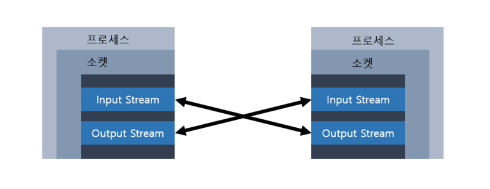

# TCP
## TCP와 UDP
> TCP/IP 프로토콜의 정의
#### 서로 다른 컴퓨터 시스템간의 데이터 통신(데이터 전송)을 위한 표준 프로토콜
* 네트워크를 상호 연결시켜 정보를 전송할 수 있도록 하는 기능을 가진 다수의 프로토콜이 모여 있는 프로토콜의 집합
* TCP란 데이터의 흐름과 정확성을 관리하고 확인하는 역할을 하고, IP는 목적지에 패킷을 전송하는 역할
> TCP/UDP의 차이점
#### TCP
* **전화**에 비유, 전송하기 전에 먼저 상대편과 연결을 한 후에 데이터 전송을 한다.
* 전송에 실패했다면 해당 데이터를 재전송한다.
    * 신뢰있는 데이터의 전송이 요구되는 통신에 적합
    * '파일'을 주고 받는데 적합
#### UDP
* **소포**에 비유, 상대편과 연결하지 않고 데이터 전송을 한다.
* 바르게 수신되었는지 확인하지 않기 때문에 데이터가 전송되었는지 확인할 길이 없다.
* 보낸 순서대로 수신한다는 보장이 없다.
* 확인 과정이 필요하지 않기 때문에 TCP에 비해 빠른 전송이 가능하다.
--- 
## 소켓 프로그래밍이란?
> 소켓의 정의
#### 프로세스간의 통신에 사용되는 양쪽 끝단(End Point)를 의미
* java.net 패키지를 이용하여 자바에서 소켓 프로그래밍을 사용 할 수 있다.
* 사용되는 프로토콜(TCP/UDP)에 따라 다른 종류의 소켓을 구현하여 제공한다.
---
## TCP 소켓 프로그래밍
> 통신 과정
* 클라이언트와 서버간의 일대일 통신이기 때문에 클라이언트의 연결 요청을 기다리고 있어야한다.
```text
1. 서버 프로그램에서는 '서버소켓'을 사용해서 서버 컴퓨터의 '특정포트'에서 클라이언트의 연결요청을 처리할 준비를 한다.
2. 클라이언트 프로그램은 접속할 서버의 'IP 주소'와 '포트 정보'를 가지고 소켓을 생성하여 서버에 연결을 요청한다.
3. 서버소켓은 클라이언트의 연결요청을 받으면 서버에 '새로운 소켓'을 생성하여 클라이언트의 소켓과 연결되도록 한다.
4. '클라이언트의 소켓'과 새로 생성된 '서버의 소켓'은 서버소켓과 관계엾이 '일대일 통신'을 한다.
```
* 전화 시스템과 유사
    * 서버소켓 : 전화교환기
    * 소켓 : 전화기
        * 실제 통화 : 전화기(소켓) <-> 전화기(원격 소켓)
* 서버소켓은 포트를 독점한다.
    * 한 포트에 서버소켓이 여러개이면 클라이언트 프로그램이 어떤 서버소켓과 연결되어야하는지 알 수 없을 것
        * 프로토콜이 다르면 같은 포트를 사용할 수 있지만 권장하지 않는다.
* 포트 : 호스트(컴퓨터)가 외부와 통신을 하기 위한 통로
    * 포트의 번호는 0 ~ 65535에 해당하는 범위를 가지고 있다.
    * 보통 1023번 이하는 FTP나 Telnet과 같은 다른 통신프로그램들에 의해 사용되는 경우가 많기 때문에 1023번 이상의 포트를 골라 사용해야한다.
* 정리
    * 서버소켓은 소켓간의 연결만 처리
    * 소켓들이 데이터를 주고받는 연결통로는 입출력스트림
    * 소켓은 입력스트림, 출력스트림을 가지고 있으며 이 스트림은 연결된 상대편 소켓들과 교차연결된다.

  
  * TcpIpServer.java 파일 참조
  * TcpIpClient.java 파일 참조