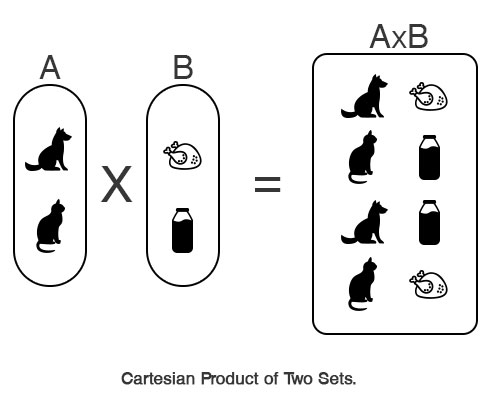
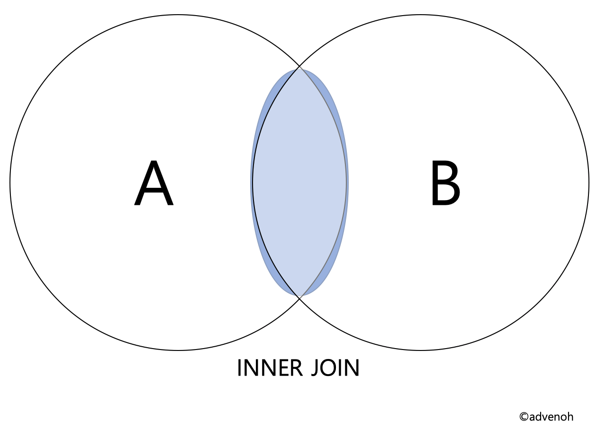

# SQL join

- employees

```
+--------+------------+------------+-----------+--------+------------+---------+
| emp_no | birth_date | first_name | last_name | gender | hire_date  | dept_no |
+--------+------------+------------+-----------+--------+------------+---------+
|  10001 | 1953-09-02 | Georgi     | Facello   | M      | 1986-06-26 | d001    |
|  10002 | 1964-06-02 | Bezalel    | Simmel    | F      | 1985-11-21 | d002    |
|  10003 | 1959-12-03 | Parto      | Bamford   | M      | 1986-08-28 | d002    |
|  10004 | 1954-05-01 | Chirstian  | Koblick   | M      | 1986-12-01 | d003    |
|  10005 | 1955-01-21 | Kyoichi    | Maliniak  | M      | 1989-09-12 | d004    |
|  10006 | 1953-04-20 | Anneke     | Preusig   | F      | 1989-06-02 | NULL    |
|  10007 | 1957-05-23 | Tzvetan    | Zielinski | F      | 1989-02-10 | NULL    |
+--------+------------+------------+-----------+--------+------------+---------+
```

- departments

```
+---------+-----------------+
| dept_no | dept_name       |
+---------+-----------------+
| d005    | Development     |
| d002    | Finance         |
| d003    | Human Resources |
| d001    | Marketing       |
| d004    | Production      |
+---------+-----------------+
```

1. JOIN?

   - 서로 관련된 테이블의 데이터를 연결하여 추출하는 방법

2. inner join

   1. cross join (교차 조인)
      

      - 두 테이블의 데이터를 특별한 조건 없이 1:1로 모두 연결
      - 명시적 표현 (explicit notation)

      ```
      select *
      FROM employees
      CROSS JOIN dept_emp;
      ```

      - 암묵적 표현 (implicit notation)

      ```
      SELECT *
      FROM employees, dept_emp;
      ```

   2. inner join (equi join) (내부 조인, 등가 조인)
      

      - 조인 조건문에 따라 2개의 테이블의 컬럼을 합쳐 새로운 테이블을 생성하는 조인
      - 조인 조건식에 '='를 사용해 동등 비교를 사용하는 조인
      - 명시적 표현

        ```
         SELECT *
         FROM employees
           INNER JOIN dept_emp
              ON employees.emp_no = dept_emp.emp_no;
        ```

      - 암묵적 표현
        ```
        SELECT *
        FROM employees, dept_emp
        WHERE employees.emp_no = dept_emp.emp_no;
        ```

   3. non-equi join(비등가 조인)

      - 동등 비교(=)를 사용하지 않는 조인을 비등가 조인(non-equi join)이라고 함
      - 표현법
        ```
        SELECT *
        FROM employees, departments
        WHERE employees.emp_no between 10003 and 10004;
        ```

   4. natural join(자연 조인)
      - 동등 조인의 한 유형으로 두 테이블의 동일한 컬럼명을 조건으로 이용
      - 같은 이름을 가진 컬럼은 한 번만 추출됨
      ```
      SELECT *
      FROM employees NATURAL JOIN dept_emp;
      ```

3. outer join(외부 조인)

   - inner join의 경우 공통 칼럼명 기반으로 결과를 가져오지만, outer join은 조건문에 만족하지 않는 행도 가져옴
   - 조인을 했을 때 한 쪽 테이블에 데이터가 없어도 결과에 포함시키는 조인

   1. left outer join
      

      - 기준이 되는 테이블의 모든 데이터와 매칭되는 테이블의 레코드를 가져오는 조인

      ```
      SELECT *
      FROM table1
          LEFT OUTER JOIN table2
              ON table1.n = table2.n;

      SELECT *
      FROM employees
          LEFT OUTER JOIN departments
            ON employees.dept_no = departments.dept_no;
      ```

   2. right outer join
      

      - 기준이 되는 테이블의 레코드와 매칭되는 테이블의 모든 데이터를 가져오는 조인

      ```
      SELECT *
      FROM table1
          RIGHT OUTER JOIN table2
              ON table1.n = table2.n;

      SELECT *
      FROM employees
          RIGHT OUTER JOIN departments
              ON employees.dept_no = departments.dept_no;
      ```

   3. full outer join
      

      - 기준이 되는 테이블과 매칭하는 테이블의 모든 데이터를 가져오는 조인
      - 명시적 SQL 구문은 없지만, UNION을 사용해 구현 가능

      ```
      # 방법1 : JOIN와 UINION
      SELECT *
      FROM table1
      LEFT OUTER JOIN table2
          ON table1.n = table2.n
      UNION
      SELECT *
      FROM table1
      RIGHT OUTER JOIN table2
          ON table1.n = table2.n;

      # 방법2 : UNION ALL and exclusion join
      SELECT *
      FROM table1
      LEFT OUTER JOIN table2
          ON table1.n = table2.n
      UNION ALL
      SELECT *
      FROM table1
      RIGHT OUTER JOIN table2
          ON table1.n = table2.n
      WHERE table1.n IS null;

      SELECT *
      FROM employees
      LEFT OUTER JOIN departments
          ON employees.dept_no = departments.dept_no
      UNION
      SELECT *
      FROM employees
      RIGHT OUTER JOIN departments
          ON employees.dept_no = departments.dept_no;
      ```

4. self join

   - 자기 자신과 조인하는 조인

   ```
   SELECT A.first_name AS EmployeeName1, B.first_name AS EmployeeName2, A.dept_no
   FROM employees AS A, employees AS B
   WHERE A.emp_no <> B.emp_no
   AND A.dept_no = B.dept_no;
   ```

5. anti join

   - 서브 쿼리를 사용해 서브 쿼리내에서 존재하지 않는 데이터만 추출하여 메인 쿼리에서 추출하는 조인
   - not exists나 not in을 사용해서 구현 가능
   - (<-> semi join)

   ```
   SELECT *
   FROM employees AS e
   WHERE emp_no >= 10002
       AND NOT EXISTS(SELECT *
                       FROM departments AS d
                       WHERE e.dept_no = d.dept_no
                           AND d.dept_no >= 2);
   ```

6. semi join

   - 서브 쿼리를 사용해 서브 쿼리 내에서 존재하는 데이터만 추출하여 메인 쿼리에서 추출하는 조인
   - exists나 in을 사용해서 구현 가능
   - (<-> anti join)

   ```
   # EXISTS 사용
   SELECT *
   FROM departments as d
   WHERE EXISTS(SELECT *
               FROM employees AS e
               WHERE e.dept_no = d.dept_no
                   AND e.emp_no >= 10003);

   # IN 사용
   SELECT *
   FROM departments as d
   WHERE d.dept_no IN (SELECT e.dept_no
                       FROM employees AS e
                       WHERE e.emp_no >= 10003);
   ```

출처: https://advenoh.tistory.com/23
